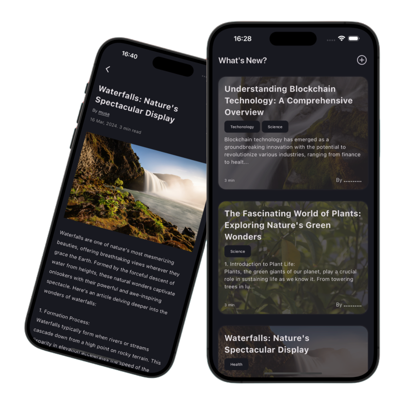

# Blog Application




This is a blog application built using Flutter and Supabase. It allows users to register with Supabase Auth and access a collection of blogs. The application employs clean architecture and a feature-based folder structure for better organization.

## Features

- User registration and authentication with Supabase Auth.
- Displaying blogs from the Supabase database.
- Offline caching of blogs for users without an internet connection.
- CRUD operations for user profiles and blogs.


## Setting Up

To set up the project, follow these steps:

1. Run the SQL scripts on your Supabase instance to create the necessary tables and policies.

```sql
-- Create a table for public profiles
create table profiles (
  id uuid references auth.users not null primary key,
  updated_at timestamp with time zone,
  name text,

  constraint name_length check (char_length(name) >= 3)
);
-- Set up Row Level Security (RLS)
-- See https://supabase.com/docs/guides/auth/row-level-security for more details.
alter table profiles
  enable row level security;

create policy "Public profiles are viewable by everyone." on profiles
  for select using (true);

create policy "Users can insert their own profile." on profiles
  for insert with check (auth.uid() = id);

create policy "Users can update own profile." on profiles
  for update using (auth.uid() = id);

-- This trigger automatically creates a profile entry when a new user signs up via Supabase Auth.
-- See https://supabase.com/docs/guides/auth/managing-user-data#using-triggers for more details.
create function public.handle_new_user()
returns trigger as $$
begin
  insert into public.profiles (id, name)
  values (new.id, new.raw_user_meta_data->>'name');
  return new;
end;
$$ language plpgsql security definer;
create trigger on_auth_user_created
  after insert on auth.users
  for each row execute procedure public.handle_new_user();


create table blogs (
  id uuid not null primary key,
  updated_at timestamp with time zone,
  poster_id uuid not null,
  title text not null,
  content text not null,
  image_url text,
  topics text array,
  foreign key (poster_id) references public.profiles(id)
);


alter table blogs
  enable row level security;

create policy "Public blogs are viewable by everyone." on blogs
  for select using (true);

create policy "Users can insert their own blogs." on blogs
  for insert with check (auth.uid() = id);

create policy "Users can update own blogs." on blogs
  for update using (auth.uid() = id);


-- Set up Storage!
insert into storage.buckets (id, name)
  values ('blog_images', 'blog_images');


create policy "Blog images are publicly accessible." on storage.objects
  for select using (bucket_id = 'blog_images');

create policy "Anyone can upload a blog." on storage.objects
  for insert with check (bucket_id = 'blog_images');

create policy "Anyone can update their own blog." on storage.objects
  for update using (auth.uid() = owner) with check (bucket_id = 'blog_images');
```

<br>
<br>
<b>DON'T FORGET MAKE BUCKET PUBLIC ! </b>! 
<br>
<br>

2. Create an `.env` file in the root directory of the project and enter your Supabase API key and URL.

```plaintext
SUPABASE_API_KEY=your-api-key
SUPABASE_URL=your-supabase-url
```


3. Clone the repository.
4. Run the application on your preferred Flutter development environment.

## Database Schema

The application utilizes two main tables:

### Profiles

- `id` (UUID): References the `auth.users` table.
- `updated_at` (Timestamp with Timezone): Last updated timestamp.
- `name` (Text): User's name.

### Blogs

- `id` (UUID): Unique identifier for the blog.
- `updated_at` (Timestamp with Timezone): Last updated timestamp.
- `poster_id` (UUID): References the `public.profiles` table.
- `title` (Text): Title of the blog.
- `content` (Text): Content of the blog.
- `image_url` (Text): URL of the blog's image.
- `topics` (Text Array): Array of topics associated with the blog.

## Row Level Security (RLS)

The application employs Row Level Security (RLS) for data access control. Policies are set up to ensure:

- Public profiles and blogs are viewable by everyone.
- Users can only insert and update their own profile and blogs.

## Storage

The application utilizes Supabase Storage for managing blog images. Policies are set up to ensure:

- Blog images are publicly accessible.
- Anyone can upload and update their own blog images.

## Folder Structure

The project follows a feature-based folder structure for better organization. Each feature/module has its own folder containing relevant files.

## Contributing

Contributions are welcome! Feel free to open issues or pull requests for any improvements or features you'd like to see.

